# Bricklaying with RL

**A physics-based bricklaying robot, and the reward function that taught it to build.**

**Bricklaying with RL** is a Gymnasium + PyMunk environment where a mobile robot lays a running-bond
brick wall to real construction tolerances — every brick within **BIM ±3mm**, judged by
live rigid-body physics, so a careless placement can topple the wall. This README is the
build log of that robot: what its reward function had to encode, which pieces of it were
wrong, how each failure was diagnosed, and what finally worked.


That is `robot18`, the current policy, laying a UK-terrace facade — two round-arched windows
and a segmental-arched door, three real structural arches built the way masons build them:
voussoir rings closed at a keystone and struck once their centering is pulled. **100% fill,
every ring closed, every one standing.** It got there without a bigger network. Every gain
in this project came from changing what the reward function measures and when it pays out.

**Why this exists.** I built this because of [**Monumental**](https://www.monumental.co), the
Amsterdam startup building autonomous bricklaying robots — their work is a genuinely good
fit for reinforcement learning: a physical task with a hard, checkable notion of "correct."
It's also the software complement to my day-job work on VLM blueprint reading. This is an
ongoing project; the roadmap at the bottom is live.

**Who this is for.** You don't need to know how PPO or a Gaussian policy works to follow
this — I'll introduce the two or three RL ideas that matter (reward shaping, action masking,
curriculum) as they come up. What I assume instead is that you're comfortable with the idea
of a reward function as *the thing that defines the task* — and that you're curious what it
actually takes to get one right.

---

## The site rules

Before the reward function, the site it operates on:

- **One step, one brick.** Each action places a single brick (or moves the robot). The
  environment tells the agent which *kind* of brick the plan calls for at the next open
  slot — a mason is handed the plan, not asked to invent it — and the agent controls *where
  exactly* to put it and, for the mobile robot, whether to move first.
- **A rail-mounted robot with a short reach.** The robot sits on a 1D rail with **500mm**
  of reach either side. Real walls run longer than that, so the robot *has* to move — and
  moving costs a little and earns nothing directly. Whether to walk or place is a genuine
  decision, not a formality.
- **Sensors, not the blueprint.** The robot doesn't see a picture of the wall. It reads
  ~28 scalars — is work in reach and which way, how the last brick landed, how much is
  left, am I at a rail end — the same shape for a 4×3 wall or a 40-course facade pier. A
  driving instructor doesn't hand a new driver a satellite photo; they teach them to read
  the dashboard and the road ahead. This env does the same: the observation is what the
  robot can *sense*, not what a bystander could *see*.
- **Physics is the adversary, not a formality.** There is no mortar adhesion — a brick
  placed badly can slide, tilt, or take its neighbours down with it. Collision shapes are
  the brick inflated by half a mortar joint, so courses stack at exactly 60mm and modules
  abut at exactly 220mm; high friction stands in for fresh-mortar tack, but nothing sticks
  by fiat. If it stands, it stood on its own.

Two policies bound the problem. `random` drops bricks with no regard for the plan; `oracle`
is a privileged policy that places every brick exactly on target — the reward ceiling, and
the environment's own integration test:

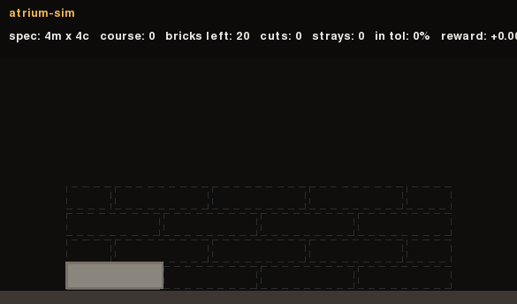
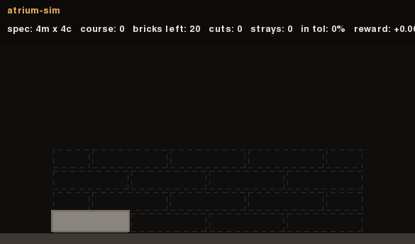

| policy | return | bricks within ±3mm | notes |
|---|---|---|---|
| oracle | **+12.80** | **100%** | privileged: every brick on target — the ceiling |
| greedy | −2.23 | 24.4% | places the next open slot, always full — wastes cuts at odd-course ends |
| random | −7.71 | 1.1% | the floor |

Everything in between is what this project is about.

```python
import gymnasium as gym
import atrium_sim  # registers the envs

env = gym.make("atrium_sim/BrickLayerRobot-v0")
obs, info = env.reset(seed=1)
obs, reward, terminated, truncated, info = env.step(env.action_space.sample())
```

---

## Building a reward function from the ground up

A reward function for a task this physical isn't one number you tune — it's several
layers, each solving a different failure mode the layer below leaves open. Here's the
project's, built up the way it was actually built: layer by layer, each one motivated by
what broke without it.

### Layer 0 — the reward *is* the site inspection

Start from what a real quality inspector does: walk the finished wall, measure every
brick against the drawing, and score it. `atrium_sim.reward.audit()` is exactly that,
as a pure function — no simulator access, no learned components, no randomness. It takes
brick poses in and hands back, per brick, how far off position and angle it landed:

- **full credit inside the BIM tolerance** — ±3mm position, ±0.5° level — and a smooth
  Gaussian falloff outside it, not a cliff. A brick 4mm off isn't "wrong," it's *almost
  right*, and the gradient needs to say so.
- **quality is multiplicative**, position score × angle score, so a brick that's
  dead-center but tilted can't farm reward from position alone.
- **strays cost.** A placed brick that matches nothing on the plan, or a brick that fell
  off-canvas, is waste, charged against the score.

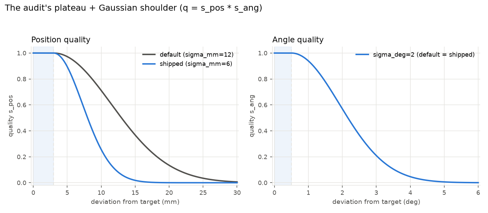

The shipped policy trains with a *sharper* shoulder than the dataclass default
(`sigma_mm=6` instead of `12`) — a deliberately unforgiving gradient once you're inside
roughly a course-height of the target, so the last few millimetres of precision still
matter to the score instead of blurring into "close enough."

This function alone, run once against a finished wall, is a decent audit tool. It is not
yet a reward — an RL agent needs a signal *every step*, not one verdict at the end.

### Layer 1 — a step-by-step version that doesn't lose the plot

The audit defines a **potential** Φ(wall): plug in the current state of the wall, get a
score. The per-step reward is simply the *change* in that potential, ΔΦ — a standard
technique called potential-based shaping. It buys two things almost for free:

- **The math self-corrects.** If a brick placed three steps ago gets nudged out of
  tolerance by a later collision, Φ drops *at that moment* and the agent is charged then —
  no separate bookkeeping needed to "remember" that brick was ever good.
- **Nothing is lost in translation.** Sum every per-step reward across an episode and,
  because the terms telescope, you get back exactly the *final* audit score (plus a few
  terminal bonuses). The number in an eval table and the number the policy optimized are
  the same number. This is pinned by a test that asserts it to `1e-9` over random rollouts
  (`tests/test_reward.py`), and by a fully worked example: a brick 2mm/0.2° off scores
  `+0.490`; a second at 8mm/1.5° scores `+0.317`; a toppled third brick that also drags a
  neighbour out of tolerance scores `−0.535` — and the three sum, telescoped, to the
  wall's own final score.

### Layer 2 — making the gradient reachable at all

The first version of this project let the agent choose a brick's x-position *anywhere
along the wall*. It failed completely — every attempt piled bricks in one spot. The
diagnosis: matching a placed brick to its target requires landing within a **55mm gate**,
but the action spans a wall that can be metres long. Random exploration over that whole
range essentially never lands inside a 55mm window — there's no gradient to climb, because
almost nowhere the policy tries produces *any* signal above baseline.

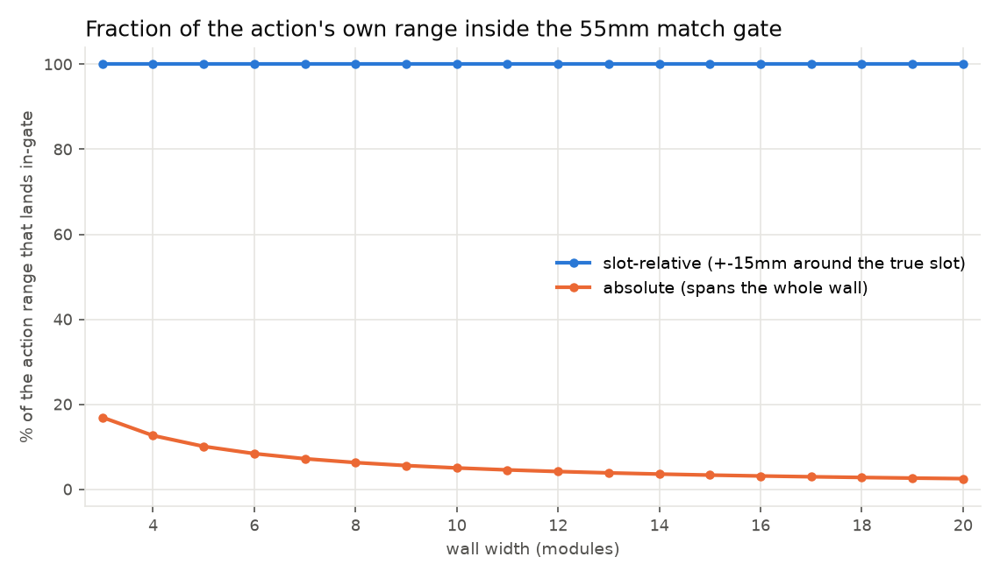

The fix wasn't a bigger network or more exploration — it was **narrowing what the action
controls**. Instead of choosing an absolute position, the agent now nudges ±15mm around a
slot the environment already picked. That's small enough that the *entire* action range
sits inside the match gate by construction, for a wall of any length — turning "find a
needle in a wall-sized haystack" into "how would you like your ±15mm to be spent." The
gradient exists everywhere the policy actually looks.

### Layer 3 — teaching it to walk

Once placement was learnable, the robot still had to decide *when* to move. Three terms do
this:

- **Reach shaping.** A dense, potential-based reward for closing the distance to the
  nearest open target — `c_reach × Δdistance`, capped at a fixed 2000mm rather than scaled
  by wall length (a mistake covered in the diagnosis below). This supplies the only signal
  that says "walk this way," since a move by itself earns nothing else.
- **A flat move cost**, so wandering isn't free even when it's harmless.
- **A wander penalty** that only fires on moves that make the *distance to work worse*
  after three consecutive moves with no placement. It has to be this selective: finishing
  one course and crossing back to the start of the next requires a long empty traverse, and
  punishing that traverse would punish the correct build order.

### Layer 4 — a milestone bonus that doesn't drown precision

Completing a course earns a bonus, meant to reward "finish this level, then move up." The
first version paid a flat `+1.0` per course — which sums to `n_courses` over a whole wall.
On a 12-course wall, that's `12`, against `r_scale=10` — **the entire mass of the precision
reward for the whole wall.** The milestone bonus was drowning the one signal that actually
teaches accuracy, and taller walls got measurably worse at precision as a direct result.

The fix: make the course bonus a potential too, with a *fixed total mass* regardless of wall
height (`course_bonus_frac × r_scale`, spread over however many courses exist). A 3-course
wall and a 14-course wall now compete for the same fixed pot of milestone reward — so it
scales with progress, never with height.

### Layer 5 — terminal integrity

Every episode ends one of four ways: the wall completes, it collapses, the step budget
runs out, or the robot gives up on a permanently blocked target. Every single one of those
paths runs an **extra settle and re-audit before paying anything** — so "shove the wobbling
wall and quit," "sag through the finish line just before the timer," and "slow-collapse
right up to the step cap" are all charged as the collapses they are, not scored as whatever
the wall looked like a split-second before it fell. There's also no STOP action — an agent
can't dodge a bad outcome by ending the episode early.

### Layer 6 — arch statics

Later, the task grew real structural arches — a curved ring of tapered voussoir bricks
built from both sides toward a keystone, resting on temporary formwork (a *centering*)
that's struck once the ring closes. The reward mirrors the flat-wall design exactly:
ring-closure progress is a potential (fixed total mass, any number of arches), and the
strike itself pays a real ±1.0 the instant the centering comes out and the ring either
holds or doesn't — a genuine structural event, not a proxy for one.

### The whole recipe

Every coefficient below except three is untouched from its dataclass default. The three
that do change are the ones that matter most to *feel* — how forgiving is a near-miss, how
harshly is waste charged, how afraid should the policy be of the hardest bricks:

| term | magnitude | default | shipped (`robot18`) |
|---|---|---|---|
| position/angle shoulder | Gaussian beyond ±3mm/±0.5° | `sigma_mm=12` | **`sigma_mm=6`** — a sharper gradient |
| waste cost | per stray/off-canvas brick | `c_waste=0.5` | **`c_waste=0.25`** — softer, so the policy dares the hard last bricks |
| collapse penalty | on top of the potential crater | `collapse_penalty=2.0` | **`collapse_penalty=0.5`** — same reasoning |
| step cost | `−0.02 × r_scale / n` per step | 0.02 | unchanged |
| reach shaping | `c_reach × Δdist`, cap 2000mm | `c_reach=2.0` | unchanged |
| course milestone | `0.3 × r_scale` total, any height | `0.3` | unchanged |
| move cost / wander penalty | `0.05` / `0.1 × r_scale/n` | — | unchanged |
| arch ring closure | `0.3 × r_scale` total, any # arches | `0.3` | unchanged |
| arch strike survive/collapse | flat `±1.0` | — | unchanged |
| completion bonus | `+1.0` fill, `+2.0` if perfect | — | unchanged |

**Hack-resistance, by design, not by patch:** no STOP action; strays are strictly negative;
every terminal path re-audits after an extra settle, before any bonus is paid. None of
these were bolted on after an exploit was found — they were there from the first version,
because the audit-as-reward design makes them nearly free.

---

## The ladder: every plateau, its cause, its fix

The reward layers above are the *destination*. Getting there took twelve diagnosed
plateaus — each one a policy that looked stuck, a specific measured cause, and a change
that unstuck it. Held-out return and precision across the five most load-bearing runs:

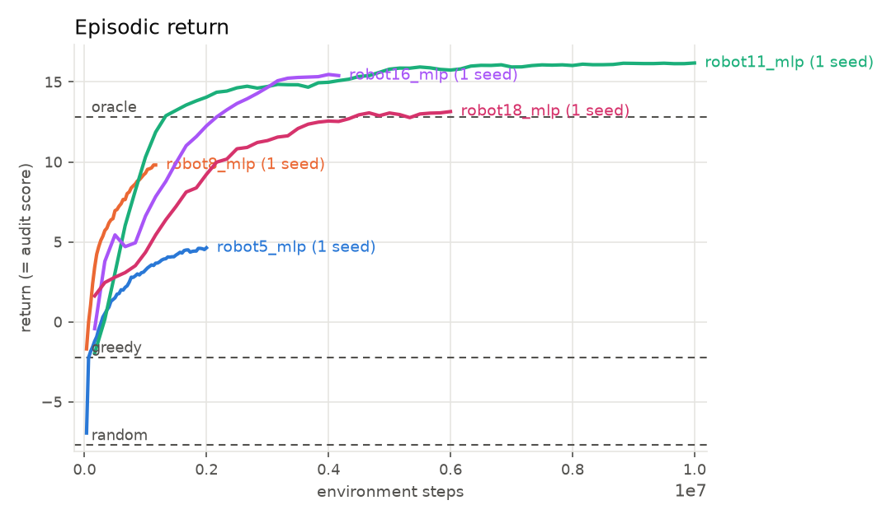
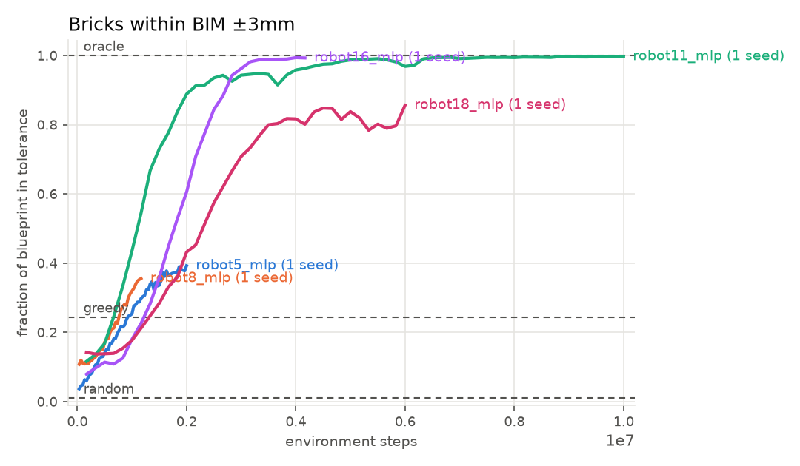

| run | what changed | fill | within ±3mm | completes |
|---|---|---|---|---|
| `robot5` | slot-relative actions (Layer 2) | 0.678 | 0.43–0.47 | 0% |
| `robot7` | support-based build order, breaking a 0.68 ceiling seven runs hit identically | 0.755 | 0.47–0.50 | 0% |
| `robot8` | the env dictates brick *kind* from the plan | **1.00** | 0.25–0.38 | **100%** |
| `robot11` | model-controlled drop height (below) | 1.00 | **0.995–1.00** | 100% |
| `robot16` | size curriculum + scale-invariant course bonus (Layers 3–4) | 1.00 | 0.9995–1.00, **zero-shot on walls 2.3× taller** | 100% |
| `robot18` | reach-relative encoding + action masking (below) | 1.00 | 5.4% → **99.4%** over training | 100% |

**`robot5` → `robot7`: the 0.68 ceiling.** `robot5` and `robot6` (bit-identical runs)
plateaued at 67.8% fill and, critically, **0% completion** — and a parallel 10-backbone
sweep on the same task confirmed it wasn't a network problem: every single architecture
also completed 0% of episodes, capping out anywhere from 17% to a best of 67.8% fill. The
build order was forcing a diagonal backtrack that never finished a course before starting
the next. Fix: build strictly course-by-course, left-to-right.

**`robot7` → `robot8`: it never placed a single half-brick.** Per-course analysis showed
the always-choose-FULL brick was the policy's easy attractor whenever kind was a learned,
sign-thresholded action — so every course-end half-brick (and everything resting on it) was
silently skipped. Fix: the environment now dictates kind from the blueprint. First fully
completed walls, ever.

**The drop-height surprise (`robot11`).** A separate axis of realism: instead of a brick
appearing gently just above its slot, the arm homes at the top of the wall and the policy
chooses *how far to lower it* before releasing — impact velocity becomes a genuine physical
consequence of the fall, not a fixed number. The intent was to make precision *harder*.
It did the opposite:

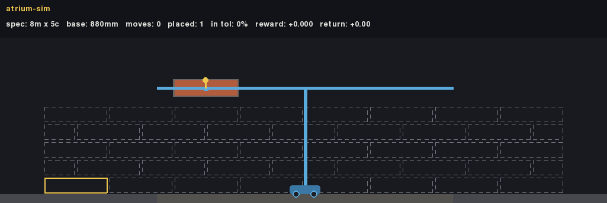

Precision jumped from ~25% to **99.5%** within tolerance — the single largest gain in the
project, and the policy achieves it by releasing from *near the top* of its full range, the
hardest drop available, not a gentle one. A follow-up run added an explicit penalty on
release height to push toward gentler placement — and it backfired: pushing the mean
release height down from "near the top" to "fully lowered" *dropped* precision to 54.5%.
Whatever this policy is doing with the fall, punishing the mechanism that works made it
worse, not better. That thread is still open — noted honestly rather than dressed up.

But drop control has a real edge, and it's the same edge every policy in this project
eventually hits: pushed past the size it trained on, `robot11` doesn't degrade gracefully —
it frantically drops ~200 bricks into the third of the wall it can still reach:

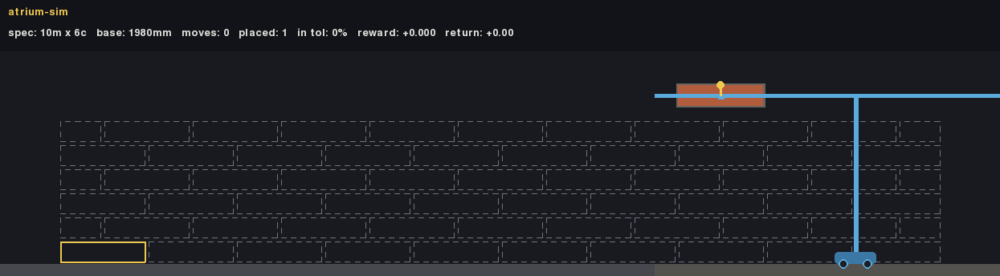

**The generalization plateau, and its fix (`robot16`).** For a long time, every policy hit
its *training* size and stopped — not gracefully, but by collapsing. Four compounding
causes, found by measurement, not guesswork:
1. A hidden **physics ceiling**: the spawn-height probe used a fixed headroom that shrank
   as courses rose and hit zero around course 8 — no wall could physically build taller,
   whatever the policy did. Fixed to a headroom that doesn't shrink with height.
2. The **flat course bonus described in Layer 4**, drowning precision on tall walls.
3. A fixed step budget that pre-empted the environment's own size-aware one on big walls.
4. A **build order that didn't extrapolate** — a diagonal staircase that left top courses
   permanently unbuilt on anything taller than trained. Fixed by the strict course-by-course
   order plus a competence-gated **curriculum**: start on small walls, and only grow the
   ceiling once the policy has actually mastered the current one.

The exact same wall `robot11` failed on above, now solved zero-shot by a policy that only
ever trained up to 10×6:

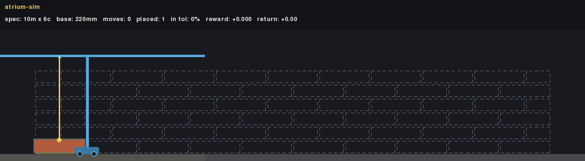
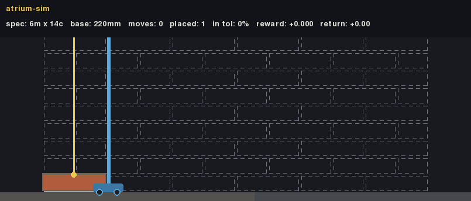

**"Stops in place," and `robot18`'s fix.** Even with size generalization solved, a subtler
bug remained on bigger structures: the sensor telling the robot *which way the nearest work
is* was normalized by **wall length**, while the robot's reach is a fixed 500mm. The exact
same physical gap read as a loud "walk over there" on a training-size wall and a faint,
easy-to-ignore signal on anything past ~2.2 metres — so the same policy that walked
correctly on small walls would simply stop and place into thin air on a big one. The same
bug existed on the *reward* side too: the reach-shaping term was normalized by wall length
as well, so a single move was worth four times as much on a small training wall as on a
big facade.

The fix has two parts, and only one of them is "try harder": every distance sensor and the
reach-shaping reward were re-normalized to the robot's own **reach**, not the wall — and
placing into nothing reachable is now **masked out of the policy's own logits**, not merely
discouraged by a penalty it can still choose to ignore. A freshly initialized, completely
untrained masked policy was verified to emit **zero** invalid placements on a real facade
plan and a 20×10 wall (versus hundreds, unmasked) — the fix removes the failure mode
structurally, before a single training step runs.

Retrained on this fix, with the curriculum uncapped through the full 20×14 ladder and
mixed with an oracle-gated library of specific skills (an exact walking distance, a void
wider than reach, a ragged multi-opening course, resuming a partially built wall, …),
`robot18`'s held-out competence over training:

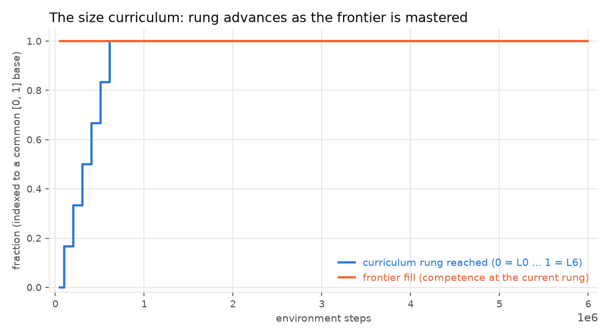
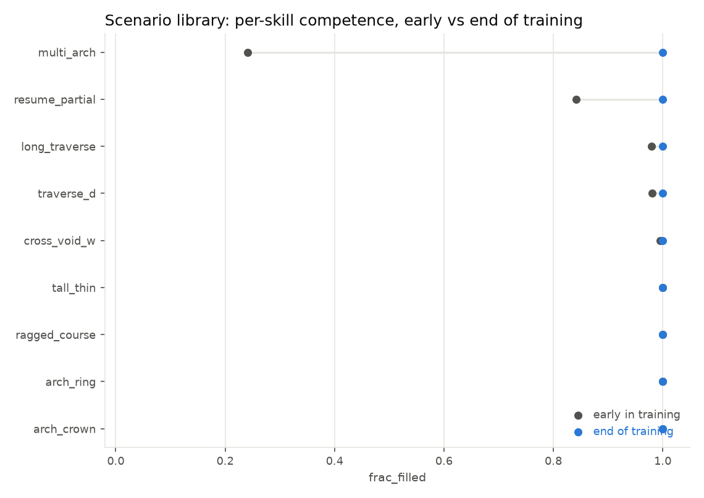
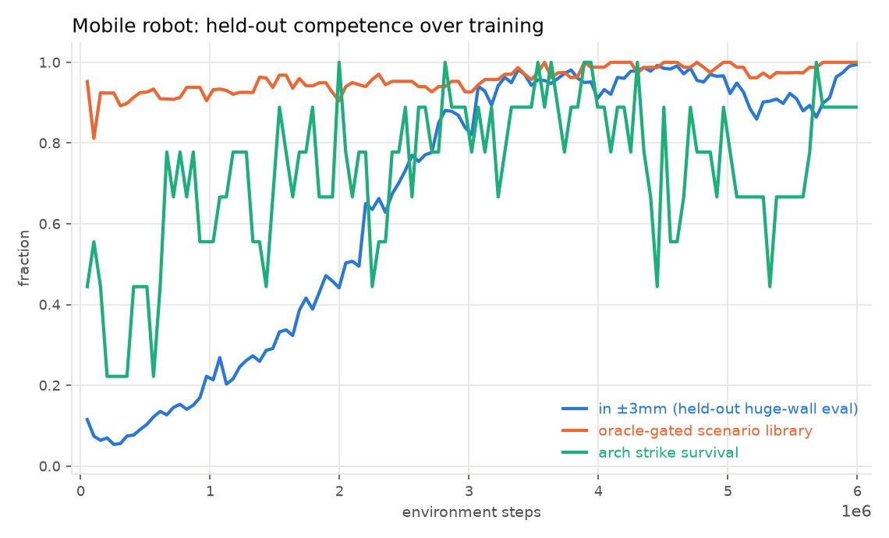

Within-tolerance precision on the held-out huge-wall suite climbs from as low as **5%**
early in training to **99.4%** at the end; fill and completion sit at 100% throughout;
every scenario-library skill converges to 100%. The scenario dumbbell chart makes the
point sharply: eight of the nine isolated skills were already close to solved from the very
first eval — the one real thing left to learn was **`multi_arch`** (a facade with more than
one opening in view at once), which climbed from 24% to 100%. A stripped-down ablation
confirms it's the arch-mix training data doing the work, not an accident: a variant trained
identically but with the arch mix turned off scored `multi_arch` at just **16%**.

---

## Beyond the flat wall: structural arches

A wall with a window needs more than a hole cut in it — the courses above the opening have
to *span* it. Real masonry does this with an arch: tapered voussoir bricks, laid from both
springings toward a keystone on temporary centering, which is then struck (removed) so the
ring proves it can stand on its own. `atrium_sim.arch` supplies the geometry for three
styles — semicircular, segmental, and jack (flat) — and `atrium_sim.facade` turns a
building plan's openings into the pier targets, ring targets, and the centering/lintels
around them. The evolution, on the same UK-terrace-style elevation:

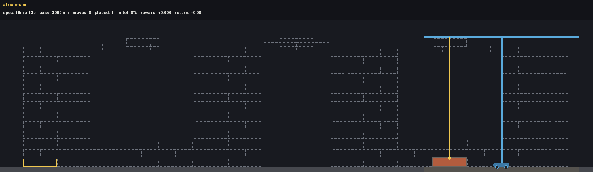
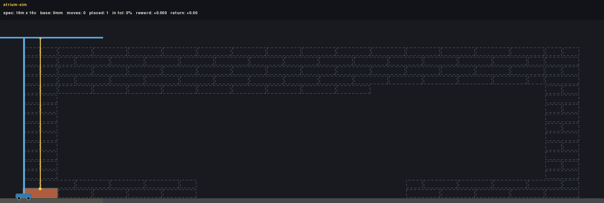
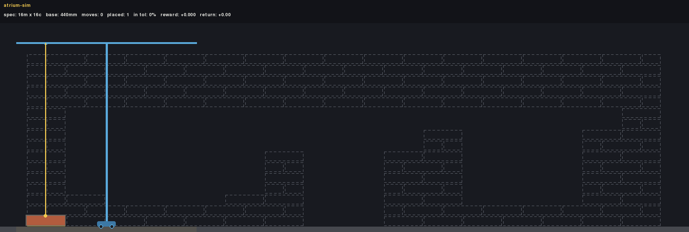

*(the checkpoint behind the third render is saved as `robot17arch2` — "robot17" is this
project's own shorthand for the arch milestone, not a literal run name.)*

Isolated arches are solid: on their own, ring closure and strike survival both hit 100% on
the semicircular and segmental styles, zero-shot. The honest gap is the *full* multi-arch
facade — `uk_terrace`, three openings (one of each real arch style) across a 16-module
elevation. Two physics bugs capped its buildable ceiling below what the reward could ever
reach (a crown-course clearance computed with the wrong sign, and successfully-seated
voussoirs being scored as stray waste forever, since they live outside the flat wall's own
target set by construction) — fixing both moved the *oracle's own* measured ceiling on this
exact plan from 36.5% fill to **61.2%**. `robot18` lands at **58.8% fill**, matching that
ceiling rather than falling short of it — it builds every course the physics genuinely
allows, then stops cleanly instead of burning its step budget:

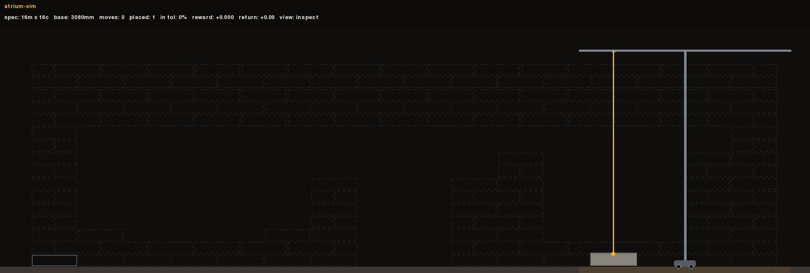

The residual gap is a real, physically-marginal seating case at the crown of the jack arch
— a documented ceiling that needs an actual physics fix, not another reward change, to
close. Ring closure on this facade is 100% across all three arches; strike survival is
**2 of 3** — the semicircular and segmental rings hold every time, the jack arch (flat,
zero rise, no arch action to redistribute load) fails every time. That specific,
reproducible gap is the subject of the architecture bake-off below.

### Does the flat-wall ladder actually predict this?

Every number above is `robot18`. A harder question: does "The ladder" section's flat-wall
progression transfer to a real, structurally different project at all, or does `uk_terrace`
measure something else entirely? Checking this meant retraining the ladder — its historical
checkpoints predate the current 28-dimension, mask-aware observation and can't even be
*loaded* into today's env. Retraining also collapsed a step: `robot5`/`robot7`/`robot8`'s
distinguishing bugs (a diagonal build order, a learned-not-dictated brick kind) are now
permanent, unconditional fixes in the env code, not flags — so under today's code all three
recipes are the same recipe, and retraining them separately would just be three copies of
one run. They collapse into a single checkpoint, `robot8_v2`. `robot11_v2` and `robot16_v2`
keep their real distinguishing hyperparameters (big-suite drop-control; size-curriculum) and
were retrained at their original step counts (2M / 10M / 4M) under today's code, then run
against the real `uk_terrace` facade for 30 held-out episodes, same as `robot18` above:

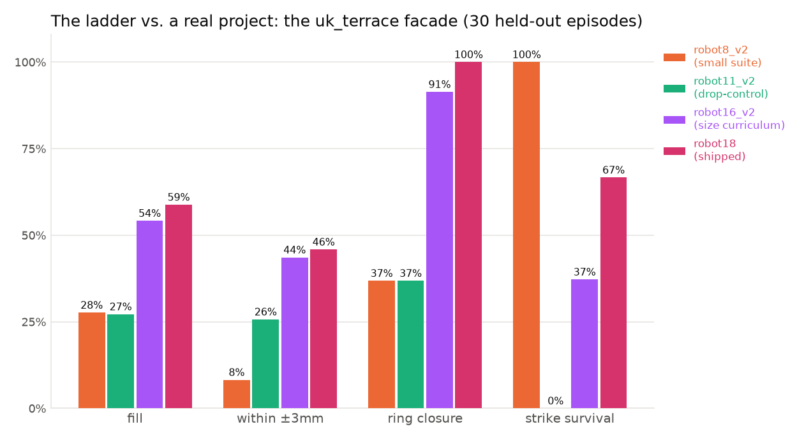

The flat-wall metrics do not predict this at all. `robot8_v2` and `robot11_v2` — trained
on small, fixed-size suites with no arch exposure — both stall around **27% fill**, and
both reach only the first (leftmost, easiest) ring's strike in *every* one of 30 episodes;
the other two rings never close. Drop control does show up, just not where fill would
suggest: `robot11_v2`'s within-tolerance precision is **26%** against `robot8_v2`'s **8%**,
the same drop-control effect the original `robot11` measured on flat walls, still present
here. `robot16_v2` is the real surprise — it has never seen a voussoir in training, yet its
size curriculum alone gets it to **91% ring closure** and a strike attempt at the jack ring
in 23 of 30 episodes.
Traversal and size competence transfer without any arch-specific training; surviving a
strike does not — `robot16_v2` holds the one ring style (segmental) it always reaches
perfectly and fails the other two, netting **37%** survival, below `robot18`'s **67%**.
Only `robot18` — the sole checkpoint actually trained with arch/scenario mixing — reaches
and survives more than one ring style at all. The lesson: a policy that's solved the flat-
wall ladder completely can still be nearly useless on a structurally different project: it
takes training exposure to the *specific* mechanic, not just wall-building competence, to
close that gap.

---

## From a photo to a buildable plan

Any photo of a brick building can become a plan: one vision-model call reads the front
elevation as a grid of 220×60mm modules and locates the openings; a deterministic tiler
(`atrium_sim.facade`) carves the remaining brickwork into non-overlapping running-bond
panels. The model is never asked to produce a valid tiling — it can't reliably do that —
only to *see* the building.

```bash
uv run python -m vlm.plan_from_image <image-url-or-path> --name colonial --render
```

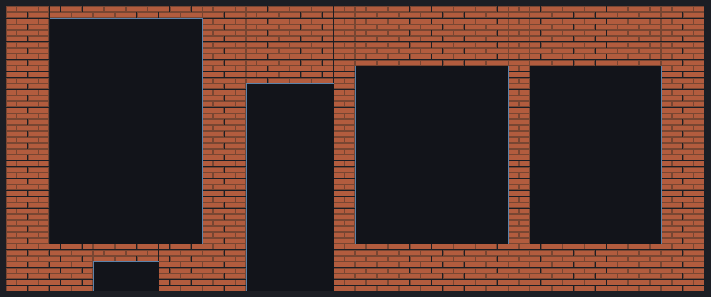

Gemini returned a 32×48 module grid with five openings for a colonial-house photo —
correctly tagging the arched picture window, the entry door, and three plain windows,
and excluding the roof and gables as non-brick — which the tiler turned into 13 panels,
855 bricks. `robot15`'s attempt at the same facade shows the honest gap between
*representable* and *buildable*: a plan can be a valid tiling and still describe a
free-standing pier that would topple under gravity in real life:

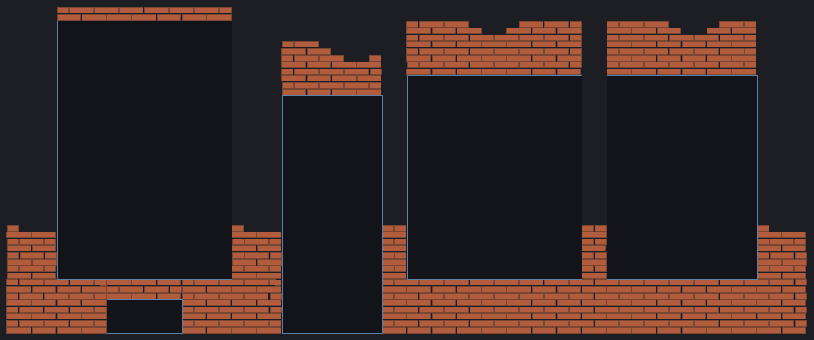

---

## Is the network architecture the lever? (No — mostly.)

Every plateau above was fixed by changing what's rewarded or how the task is structured,
never by a bigger network. Three separate 10-backbone bake-offs (MLP variants, a CNN, two
attention variants) confirm this holds across tasks: on the free-placement task, every
architecture plateaus near 0%; on the size-curriculum robot task, plain MLPs solve it
cleanly while the transformer variants barely learn it; on the reward-tuning task, every
completing backbone is an MLP variant, with the spatial architectures at the bottom.

The one place architecture shows a real, if partial, effect is the specific jack-arch
strike-survival gap above. Retraining all ten backbones under `robot18`'s exact recipe,
ranked by mean strike survival on the real `uk_terrace` facade across the *whole* training
run (not just the final checkpoint — this specific skill oscillates hard for every
architecture, so a last-checkpoint metric would call a run a loser mid-regression):

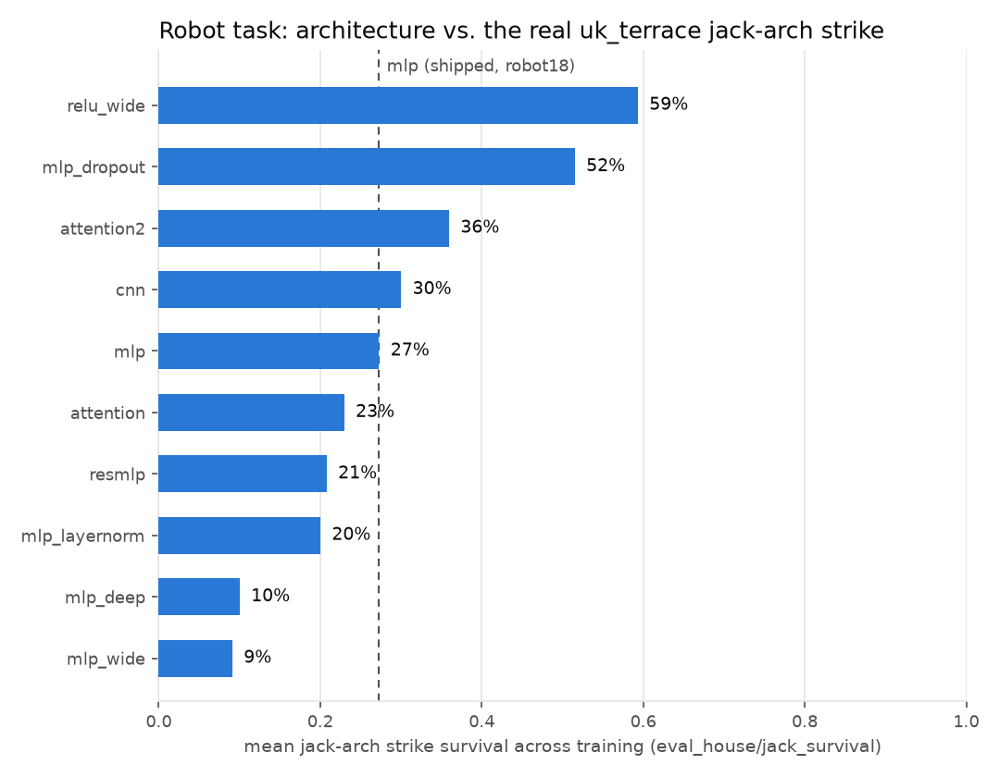

A plain activation swap (tanh→ReLU) or adding dropout roughly **doubles** the survival rate
over the shipped baseline. Neither of the two spatial architectures (CNN, attention) beats
the best MLP variant — they land in the middle of the pack, not at either end, so this
reads as capacity/regularization, not an architecture whose inductive bias actually fits
this problem. The more honest picture is the trajectory, not the final ranking:

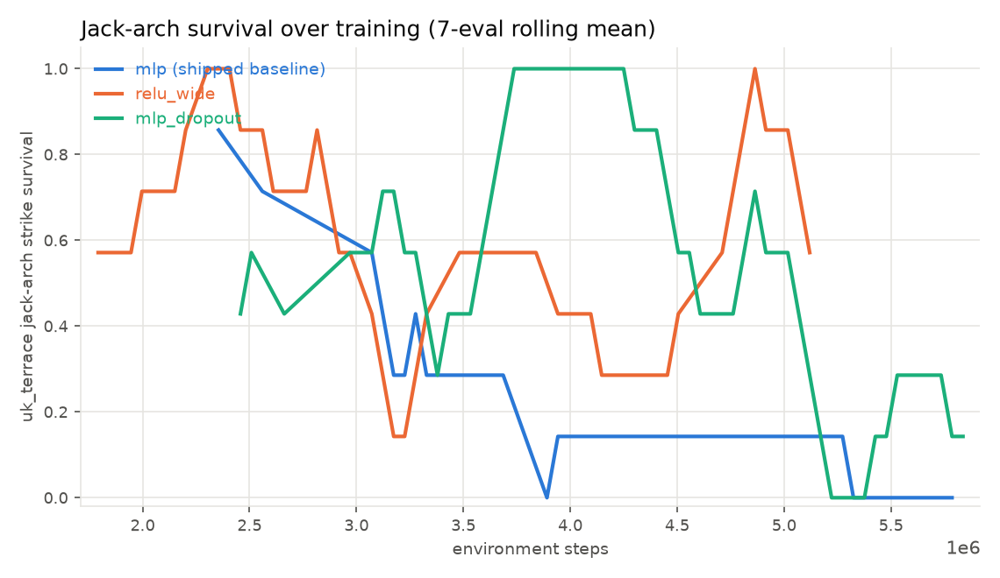

**Every** architecture oscillates; none converges. This remains a real, unsolved precision
problem — architecture is a lever here, just not a decisive one, and this was a diagnostic
sweep, not a promotion. None of these ten checkpoints replaces `robot18`.

---

## Reproduce it

```bash
uv sync --all-extras

# watch a baseline drop bricks against a ghost blueprint
uv run python -m baselines.random_agent --render human --episodes 3

# train the mobile robot - robot18's exact recipe (6M steps, ~a few hours on CPU)
uv run python -m train.ppo_robot --exp-name robot18 --seed 1 --total-timesteps 6000000 \
    --arch mlp --suite robot --eval-suite robot_huge_eval --random-start --action-mask \
    --async-envs --torch-threads 2 --curriculum --curriculum-cap 6 --arch-prob-max 0.3 \
    --arch-prob-per-level 0.15 --scenario-mix 0.35 --sigma-mm 6.0 --sigma-deg 2.0

# watch a trained policy in the browser (Next.js viewer, 2D + 3D)
cd frontend && npm install && npm run dev   # http://localhost:3000
```

Regenerate every figure in this README:

```bash
uv run python scripts/eval_baselines.py --suite interp --episodes 30 --out media/baselines.json
uv run python scripts/plot_reward_shape.py --out media/
uv run python scripts/plot_curves.py runs/robot --baselines media/baselines.json \
    --out media/ --include robot5_mlp robot8_mlp robot11_mlp robot16_mlp robot18_mlp
uv run python scripts/plot_robot_curves.py runs/robot/robot18_mlp_s1_1785778025 --out media/
uv run python scripts/plot_arch_sweep.py runs/sweep_archbakeoff runs/sweep_archbakeoff_spatial --out media/
uv run python scripts/eval_house_ladder.py --episodes 30 --out media/house_eval.json
uv run python scripts/plot_house_eval.py media/house_eval.json --out media/
```

### Frontend & webviz

`frontend/` is a Next.js (App Router, Tailwind) site over `webviz/`, which does the actual
simulation work in Python. Three pages: **`/`**, a gallery of pre-baked cases (flat walls,
the mobile robot, the arched UK terrace, the VLM-perceived colonial facade) that link
straight into a replay; **`/replay`**, the stage — a 3D/2D toggle (a react-three-fiber
scene extruding the same replay data into real solids, alongside the original 2D canvas
renderer), scrubbable playback, per-step reward, mm-deviation labels; **`/build`**, paint a
grid, add openings, pick an arch style per opening, and run it — the deterministic tiler
handles the rest server-side, so the browser never computes a panel layout itself. There is
no pre-flight buildability check on a custom plan: it's validated (no overlaps, nothing out
of grid) but not oracle-checked, so an unusual layout may turn out to be a genuinely hard,
or physically impossible, level — the replay is the feedback.

Every replay spawns `python -m webviz.episode` fresh, so it always runs the **current** env
code — there's no long-lived Python process to go stale. The policy dropdown only lists
checkpoints whose saved observation width matches the live environment's (currently 28);
older checkpoints simply don't appear rather than erroring when selected. There's also a
zero-dependency standalone server (`python -m webviz.server`) for reaching a running
instance over Tailscale from a device with no Node install — it only serves the flat-wall
env, no robot policies or arches, and is otherwise unrelated to the Next.js app.

---

## Design notes

- **Verifiable reward.** The audit is deterministic geometry, zero learned components:
  brick poses in, per-brick millimetre deviations out. The same function is the step
  reward, the terminal reward, and the eval metric.
- **Determinism.** Fixed timestep, a fresh physics world per episode, seeded generation:
  same seed + same actions ⇒ bit-identical trajectories (per platform/build).
- **Mortar-inclusive envelopes, not a mortar simulation.** Collision shapes are the brick
  inflated by half a joint; a small, deliberately tuned allowed-overlap constant keeps
  courses from sagging out of tolerance over a tall wall while still letting the physics
  engine put bodies to sleep cheaply once they've settled.

## Repo map

```
atrium_sim/           the environment package (installable, torch-free)
  blueprint.py        wall specs -> target layouts (train/interp/extrap/robot suites)
  facade.py           FacadePlan: openings/panels/arches -> a whole-house blueprint
  arch.py             arch geometry: wedges, ring build order, strike survival
  scenarios.py        oracle-gated scenario library: one skill per level
  physics.py          PyMunk world: spawn, settle-by-sleeping, out-of-bounds
  reward.py           the audit: matching, quality, potential  <- start here
  envs/               BrickLayerEnv (base) + BrickLayerRobotEnv (mobile, reach-limited)
  render/             pygame renderer + GIF recorder
train/                ppo.py / ppo_robot.py (single-file, CleanRL-style), agent.py,
                      architectures.py (the 10-backbone registry), sweep.py
baselines/            oracle / greedy / random / robot_oracle
webviz/               episode.py (per-request CLI) + server.py (legacy standalone)
frontend/             Next.js site - app/{page,replay,build}.tsx, components/
scripts/              plot_*.py (every figure in this README), eval_baselines.py,
                      eval_house_ladder.py (the ladder vs. the real uk_terrace facade)
tests/                reward worked-example pin, physics validation, PPO smoke,
                      robot env, scenario-library solvability gate
vlm/                  image -> FacadePlan (one Gemini vision call + the deterministic tiler)
```

## Roadmap

- ✅ Generalize to walls bigger than trained on — a physics-ceiling + reward-scale +
  build-order + size-curriculum fix; zero-shot to 2.3× the trained height at 100% fill.
- ✅ Model-controlled drop height — sub-mm precision via physics. Open thread: pin down
  *why* a hard drop yields better precision than a gentle one.
- ✅ Image → buildable plan (v1) — the facade section above.
- ✅ Openings + lintels in the env — real structural arches (v1): voussoir rings,
  centering, strike survival.
- ✅ Diagnose why a full multi-arch facade stalls — a length-normalized encoding bug + a
  crown-packing sign bug + voussoir-as-waste double counting. Open thread: the jack-arch
  crown's remaining gap is a genuine physics limit, not an MDP/training gap.
- ✅ Does architecture close the jack-arch strike-survival gap? — explored: a plain
  activation/regularization change roughly doubles survival, but nothing converges.
- ✅ 3D web viewer — a react-three-fiber scene alongside the original 2D canvas.
- **Build all sides of a house** — multi-wall structures with corners.
- **Arm kinematics** — polar reach / an actual arm instead of a rail; eventually 3D.
- **GRPO** — the reward is already sequence-level and audit-derived, a natural fit.

## License

MIT
