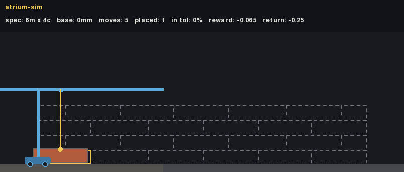

# atrium-sim

A physics-based bricklaying RL environment (Gymnasium + PyMunk). An agent lays a
running-bond brick wall against a blueprint and is scored like a real mason —
**every brick within BIM ±3mm tolerance, minimal waste** — with live physics, so a
sloppy placement can topple the wall.

**Why this exists.** I built atrium-sim because of [**Monumental**](https://www.monumental.co),
the Amsterdam startup building autonomous bricklaying robots. Their work was too cool
not to engage with, and I saw a chance to apply reinforcement learning to a real,
visual, physical problem — bricks, gravity, tolerances, a robot that has to move. It
doubles as the software complement to my day-job work on VLM blueprint reading. **This
is an ongoing, open project, not a closed-off deliverable** — the roadmap at the bottom
is very much live.

The most interesting part isn't the environment — it's the **debugging story**. A plain
128×128 MLP went from "pile every brick in one tower" to a mobile robot that navigates
in both directions and completes walls it was never trained on. Every single gain came
from **reward and task design, never a bigger network**.

---

## The mobile robot (current state)

The robot rides a 1D rail with a finite ~500mm reach, so it *has* to move to build a
wall wider than its arm. It observes the blueprint + what it's built, and each step it
chooses: **move left, move right, or place** (with a fine horizontal offset). Below,
`robot10` builds a **6×4 wall it never saw in training**, starting from a random spot on
the rail — completing it 100%, navigating as needed:



### How well it generalizes (plain MLP)

Trained only on a mix of 3–8 module × 2–5 course walls, evaluated from random start
positions:

| wall | bricks | in training? | fill | completes? |
|---|---|---|---|---|
| 3×2 – 7×4 | 6–28 | trained sizes | 1.00 | ✅ 100% |
| **4×3, 6×4** | 12–24 | **held out** | 1.00 | ✅ **100%** |
| 8×5 | 40 | held out | 0.83 | ❌ (builds most) |
| 9×5, 10×6 | 45–60 | **extrapolation** | 0.71 / 0.60 | ❌ (graceful) |

It completes unseen sizes it can interpolate, and *degrades gracefully* on walls larger
than anything it trained on — where an earlier version placed **zero** bricks and just
wandered.

### The journey (each plateau → a named root cause → a fix)

1. **Tower collapse.** Free x-placement is a gradient desert (a 55mm match gate vs a
   220mm module) → the policy piled bricks in one spot. Fix: **slot-relative** actions —
   the env picks the slot, the agent nudges ±15mm.
2. **The 0.68 ceiling.** Seven runs plateaued at ~68% fill, 0% completion. Diagnosed a
   forced boustrophedon backtrack → redesigned to a **support-based staircase** (build up
   locally, sweep once). Broke the ceiling to 0.755.
3. **Never finishing.** Per-course analysis showed it *never placed a single half-brick*
   (always-FULL was the easy attractor for a sign-thresholded action). Fix: the **env
   dictates brick kind** from the blueprint — a mason is *told* the plan. → **first
   fully-completed walls, ever.**
4. **Only sweeps right.** It completed only because it always started at the left. Fix:
   **random start + strong bidirectional reach-shaping** → it learned `MOVE_LEFT` and now
   completes from *any* start position.
5. **Doesn't scale.** It placed nothing on walls ≥6 modules — it wandered forever. Fix:
   an **anti-wander penalty** (3 moves with no placement starts costing) + a **mixed
   small→big curriculum** → the generalization table above.

### Architecture is *not* the lever

Three architecture bake-offs (10 backbones: MLP variants, CNN, attention) reached the same
verdict. On the free-placement task every architecture plateaued at ~0%. On the robot task
the plain MLPs cleanly solved it while the transformers barely learned it. And on the
drop-height task, the ranking was **every 100%-completing backbone is an MLP variant**
(layernorm/wide/plain), with the spatial ones at the bottom (CNN last, 12% completion) —
they run on the GPU and still lose to a two-layer MLP on this sample-starved, physics-bound
env. The bottleneck was always the *problem shaping*, not the network.

---

## Latest: model-controlled drop height (`robot11`)

The next task hands the physics a bigger role. Instead of each brick appearing just above
its slot, the arm **homes at the top of the wall** and the model chooses **how far to lower
it before releasing** — so impact velocity is an *emergent consequence of the fall*, not a
chosen number. It was meant to make precision *harder* (you have to learn a gentle release).

It did the opposite — and this is the strongest result in the project. Below, `robot11`
completes an **8×5 wall it never trained on** (the mobile gantry rides the rail; the tool
drops each brick from the top):


| held-out wall | fill | completes | within ±3mm | mean error |
|---|---|---|---|---|
| 4×3 / 6×4 | 1.00 | ✅ 100% | **100%** | 0.5mm |
| **8×5** (robot10 couldn't finish) | 1.00 | ✅ **100%** | **100%** | 1.0mm |
| 10×6 (extrapolation) | 0.86 | ~60% | 84% | 0.9mm |

...but push it to a **10×6 wall — bigger than anything it trained on — and it fails in a
gloriously honest way**: it barely moves and just *frantically drops ~200 bricks* from the
top into the ~65% of the wall it can reach, most bouncing off. Generalization has an edge,
and this is what it looks like:


Sub-millimeter placement, and it now finishes the big walls the fixed-drop policy couldn't.
The twist: the model releases from the **very top** (the *hardest* drop), not gently — and a
5× precision jump over the fixed-drop baseline appears at equal training budget, so the drop
control is the cause, not just more steps. **Why** a hard drop yields sub-mm placement is
still an open question I'm investigating (seating in the fully-packed course vs. a cleaner
policy gradient from activating the release dimension) — noted here honestly rather than
dressed up.

---

## The environment in 30 seconds

- **One step = one brick.** For the base env, the action is 2 floats in [-1, 1]: *where
  along the wall* and *which brick*. The row is automatic (lowest incomplete course);
  gravity does the rest. The robot env adds movement (a discrete move/place head).
- **The reward IS the audit.** A pure function `audit(wall, blueprint)` scores the
  settled geometry: full credit inside ±3mm/±0.5°, smooth Gaussian decay outside, waste
  charges for strays and toppled bricks. The per-step reward is the *change* in wall
  potential (potential-based shaping), so the undiscounted return telescopes to the final
  audit score — the exact number in the eval tables.
- **Physics is the adversary.** No mortar adhesion: a brick placed 40mm off can rest
  crooked, slide, or take the neighbours with it — and the potential drop claws the
  reward back automatically, whenever the topple happens.

```python
import gymnasium as gym
import atrium_sim  # registers the envs

env = gym.make("atrium_sim/BrickLayerRobot-v0")   # or "atrium_sim/BrickLayer-v0"
obs, info = env.reset(seed=1)
obs, reward, terminated, truncated, info = env.step(env.action_space.sample())
```

## Quickstart

```bash
uv sync --all-extras

# watch a baseline drop bricks against a ghost blueprint (human render or GIF)
uv run python -m baselines.random_agent --render human --episodes 3

# train the mobile robot (single-file CleanRL-style PPO)
uv run python -m train.ppo_robot --exp-name myrobot --suite robot_big \
    --eval-suite robot_big_eval --random-start

# watch a trained policy in the browser (Next.js viewer, robot + wall envs)
cd frontend && npm install && npm run dev   # http://localhost:3000
```

## Baselines — base env (interp suite, held-out specs)

| policy | return | bricks in ±3mm | notes |
|---|---|---|---|
| oracle | **+12.80** | **100%** | privileged: places every brick at its target — the reward ceiling and the env's standing integration test |
| greedy | −2.18 | 24% | obs-only heuristic: next open slot, always full — wastes cuts at odd-course ends |
| random | −7.39 | 0.3% | lower anchor |

A `robot_oracle` similarly completes every wall size (incl. 10×6) and is the robot env's
solvability tripwire.

## Design notes

- **Verifiable reward.** The audit is deterministic geometry with zero learned
  components: brick poses in, per-brick mm deviations out. The same function is the step
  reward, the terminal reward, and the eval metric — and later the sequence-level reward
  for GRPO / VLM-driven variants.
- **Hack-resistance.** No STOP action; strays are strictly negative; every terminal path
  (success / collapse / budget) runs an extra settle and re-audits *before* bonuses — so
  "shove the wobbling wall and quit", "sag through the finish line", and "slow-collapse
  past the cap" are all charged, not rewarded.
- **Mortar-inclusive envelopes.** No wet-mortar sim: collision shapes are the brick
  inflated by half a joint (220mm module / 60mm course exactly), high friction stands in
  for tack, no adhesion — topples are real.
- **Determinism.** Fixed dt, fresh Space per episode, seeded generation: same seed +
  same actions ⇒ bit-identical trajectories (per platform/build).

## Repo map

```
atrium_sim/           the environment package (installable, torch-free)
  blueprint.py        wall specs -> target layouts (train/interp/extrap/robot suites)
  physics.py          PyMunk world: spawn, settle-by-sleeping, out-of-bounds
  reward.py           the audit: matching, quality, potential  <- start here
  observations.py     slot tensor + globals -> vector in [-1,1]
  envs/               BrickLayerEnv + BrickLayerRobotEnv (mobile, reach-limited)
  render/             pygame renderer + GIF recorder
train/                ppo.py / ppo_robot.py (single-file), agent.py, architectures.py, sweep.py
baselines/            oracle / greedy / random / robot_oracle
webviz/ + frontend/   Next.js replay viewer (spawns a fresh Python episode per request)
tests/                reward worked-example pin, physics validation, PPO smoke, robot env
```

## Facade plans from images (VLM)

Any photo of a brick building → a buildable plan. A single Gemini vision call does the
**perception** — it reads the front elevation as a grid of 220mm × 60mm modules and
locates the openings — and a **deterministic tiler** (`atrium_sim/facade.py`) carves the
remaining brickwork into non-overlapping running-bond panels. The model is never asked to
produce a valid tiling (it can't); it only has to see the building.

```bash
uv run python -m vlm.plan_from_image <image-url-or-path> --name colonial --render
# -> plans/colonial.json (the FacadePlan) + plans/colonial_vlm_raw.json (the raw response)
#    + media/colonial_facade.png (elevation)
```


On a colonial-house photo, Gemini returned a 32×48 grid with 5 openings — correctly
tagging the **arched picture window**, the **entry door**, and three windows, and flagging
the roof/gables/porch as non-brick — which the tiler turned into 13 valid panels (855
bricks). It's an *approximation*, not a survey, but a cohesive, structured, buildable one.
Each panel is a `Blueprint` the same audit/render/oracle consume, so the facade plan feeds
straight into the rest of the pipeline.

## Roadmap (this is not a closed-off project)

- ~~Model-controlled drop height~~ ✅ **done** (see above) — and it's now the best result.
  Open thread: pin down *why* a hard drop yields sub-mm placement (a clean ablation:
  same policy, forced-gentle vs forced-hard release, to separate physics from learning).
- ~~Image/VLM → buildable plan~~ ✅ **v1 done** (facade section above). Next: openings +
  lintels in the *env* so the robot actually builds a facade panel (window void included).
- **Build all sides of a house** — multi-wall structures with corners.
- **Arm kinematics** — polar reach / an actual arm instead of a rail; eventually 3D.
- GRPO (`Agent(critic=False)` seam is already in place).

## License

MIT
