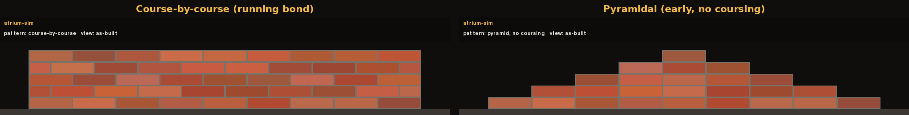

# Bricklaying with RL

A Gymnasium + PyMunk environment where a rail-mounted robot lays a running-bond brick wall,
and the PPO policy that learned to do it. Every brick is scored against the blueprint to the
BIM tolerance of ±3 mm and ±0.5°, and the wall is live rigid-body physics: a badly placed
brick can slide, tilt, or take its neighbours down with it.

https://github.com/user-attachments/assets/594de39a-b44f-41fe-a04c-c356f0409167

The video is `robot18`, the current policy, building `uk_terrace_classic`: a 16-module
Victorian terrace front with two semicircular windows and a segmental-arched door. The
arches are structural. Each ring is laid from both sides toward a keystone on temporary
centering, and the centering is pulled once the ring closes. Over 30 held-out episodes on
this plan robot18 fills 100% of the wall, closes all three rings every time, all three
survive the strike every time, and 83% of the bricks land within ±3 mm.

The policy is a small MLP, and it stayed one for the whole project (July 22 to August 10,
2026). Every improvement came from changing the reward, the action space, the observation,
or the training distribution, and I ran three ten-architecture sweeps along the way to check
whether that was still true. Most of this README is about the reward function: what it
measures, the order the pieces were added in, and what each piece fixed.

I started this because of [Monumental](https://www.monumental.co), the Amsterdam company
building bricklaying robots. A physical task with a checkable definition of "correct" is a
good fit for RL, and it sits next to my day job, which is reading construction blueprints
with vision models. I have a board of ideas for this project at the end of this repo, but I feel like I've reached a good enough point to stop playing with it for a while.

You don't need to know PPO to follow along. Where an RL idea matters (potential-based
shaping, action masking, curriculum) I explain it where it comes up. I do assume you're
comfortable treating the reward function as the definition of the task.

---

## The environment

The robot sits on a 1D rail and can reach 500 mm to either side of its base. Walls run
longer than that, so finishing one means relocating, and a move earns nothing by itself.
Each step either places a brick or moves the robot one module (220 mm) left or right. The
action is a `Tuple(Discrete(3), Box(3))`: a mode head choosing PLACE / MOVE_LEFT /
MOVE_RIGHT, plus three continuous values, an x-offset of up to ±15 mm around the current
slot, a tilt nudge for arch voussoirs (Figure below), and a release height for drop-control mode.


The environment picks the next open slot from the blueprint and tells the agent whether it
takes a full or a half brick. The agent controls where exactly the brick lands and whether
to move first. The real robots work the same way: the plan comes out of the BIM model, and
the robot handles placement.

The observation is 28 scalars: direction and distance to the nearest open work, how the
last brick landed (dx, dy, tilt), whether the last placement was valid, progress, rail
position, and the action mask. The robot never sees an image of the wall. Since the vector
has the same shape for a 4×3 wall and a 40-course pier, one policy can run on any size.

Everything is deterministic: fixed timestep, a fresh physics world per episode, seeded
generation. The same seed and actions give bit-identical trajectories on the same platform,
and evals run on fixed seeds, so every checkpoint sees identical walls.

Two scripted policies bound the problem. `oracle` has privileged access and places every
brick exactly on target; it's the reward ceiling and doubles as the environment's
integration test. `random` samples the action space.


| policy | return | within ±3 mm | fill | notes |
|---|---|---|---|---|
| oracle | **+12.80** | **100%** | 100% | privileged; the ceiling |
| greedy | −2.23 | 24.4% | 28.5% | always drops a full brick at the next slot; wastes cuts at odd-course ends |
| random | −7.71 | 1.1% | 4.9% | |

```python
import gymnasium as gym
import atrium_sim  # registers the envs

env = gym.make("atrium_sim/BrickLayerRobot-v0")
obs, info = env.reset(seed=1)
obs, reward, terminated, truncated, info = env.step(env.action_space.sample())
```

---

## How the reward function was built

The reward has seven pieces. They were added in the order below, and each one exist
because of something specific that went wrong without it. The equations are transcribed from `atrium_sim/reward.py` and `atrium_sim/envs/robot_env.py`, so every symbol is a variable you can grep for, and each step ends with the robot generations that trained on that version. Throughout, $N$ is the number of bricks in the blueprint and $r_{\text{scale}} = 10$ is the total reward available for a perfect wall, so one perfect brick is worth $r_{\text{scale}}/N$.

Since this was an evolving modelling task, I'm going to explain each iteration while tagging which generations of the robot policy were trained by it.

### 1. Score a finished wall

The starting point was a site inspection written as a function. `audit()` takes the pose of every brick on the wall plus the blueprint, matches each brick to a target, within 55 mm and 15°, and scores each match on position and angle:

$$
s_{\text{pos}}(d) =
\begin{cases}
1 & d \le 3\,\text{mm} \\
\exp\!\left(-\left(\frac{d - 3}{\sigma_{mm}}\right)^{2}\right) & d > 3\,\text{mm}
\end{cases}
\qquad
q_i = s_{\text{pos}}(d_i)\cdot s_{\text{ang}}(\theta_i)
$$

Full credit inside the tolerance, then a Gaussian decay. This shape of reward is formally known as a clipped Gaussian and it is a common practice ([Kim et al., 2024](https://www.mdpi.com/1424-8220/24/14/4540)) used to provide a smooth feedback for error correction while being less strict of perfect placement - similar to a real setting where a brick 4 mm off is nearly right instead of being completely wrong, and a placement between $0+dx mm$ and $3 mm$ doesn't really make a difference. Position and angle multiply, so a brick that is centred but tilted can't collect the position score on its own. The wall score is the sum of brick qualities minus a charge for waste, normalised by $N$:

$$
\text{score}(w) = \frac{1}{N}\left(\sum_{i \in \text{matches}} q_i \;-\; c_{\text{waste}} \cdot W(w)\right),
\qquad
\Phi(w) = r_{\text{scale}} \cdot \text{score}(w)
$$

where $W$ counts strays (bricks that match no target), bricks that fell off the canvas, and
half-bricks cut where the plan didn't call for one.


`audit()` has no simulator access, no learned parts and no randomness, so the same function
is the training reward, the terminal score and the evaluation metric. Most of the policies were trained with this reward and $\sigma_{mm} = 12$, but as more robots started acing the simple tasks I upped the challenge to use $\sigma_{mm} = 6$, which makes the last few millimetres count for more and makes a difference in large walls with more then 100 bricks.

*Generations: in from day one, before the first robot run; every checkpoint from `robot1` to `robot18` trained on this audit unchanged. The σ override is a per-run choice.*

### 2. Turn the score into a per-step reward

An RL agent needs a signal every step. The audit gives one number for the whole wall,
$\Phi(w)$, and the per-step reward is the change in that number:

$$
r_t = \Phi(w_t) - \Phi(w_{t-1}) - c_{\text{step}}, \qquad c_{\text{step}} = 0.02 \cdot \frac{r_{\text{scale}}}{N}
$$

This is potential-based shaping ([Ng, Harada and Russell, 1999](https://ai.stanford.edu/~ang/papers/shaping-icml99.pdf)), an old trick that accelerates optimal policy learning by discounting the current state score by the past state score and the cost of time each step. In simpler terms it's like giving the agent a score for the wall every step, but subtracting the score it got on the last step and adding a small penalty for taking a step. The penalty transforms wandering around into a costly action, making the reward negative when it's not making progress.

*Generations: day one, together with the audit; every run in the project, flat-wall and
robot alike, trained on ΔΦ shaping.*

### 3. Make the gradient reachable

The first version of the environment let the agent pick the brick's absolute x-position anywhere along the wall, and it failed completely: six PPO runs in a row ended with every brick piled in one spot. A brick only counts as matched to its target when it lands within a 55 mm gate, but the action ranged over the whole wall, 870 mm even on a small one. Basically I added a bug in which the policy was looking for a needle in a haystack without being told if it was close or far from the target this means random exploration almost never landed inside the gate, so it almost never saw a reward above baseline, and a gradient can't point toward something the policy never touches.


The fix: the environment picks the next open slot from the blueprint, and the action only nudges the brick up to ±15 mm around it:

$$
x = x_{\text{slot}} + a \cdot 15\,\text{mm}, \qquad a \in [-1, 1]
$$

Now the whole action range lives inside the match gate whatever the wall length, so every attempt gets a graded score instead of silence, and hitting the ±3 mm tolerance means landing $a$ within ±0.2 instead of ±0.006 - a target the exploration noise can actually stumble onto and refine. A ten-backbone sweep on the unfixed task (MLPs, a CNN, two attention variants) confirmed that no architecture compensates for a missing gradient: all of them stayed near 0%, the best at 3%.

Looking back, I could've solved this challenge without making the task easier - but the result would remain the same and learning would just take longer.

*Generations: fixed during those six flat-wall runs, before the robot series existed;
every robot checkpoint is slot-relative. `robot5` is the first checkpoint carrying it in
the ladder plots.*

### 4. Pay for walking

Up until `robot5` I hadn't really planned out how far I'd take this project, but given that it managed to fill up a 6x4 wall in the first few hours I decided to make it harder. The next step was to add a second action mode, MOVE, and make the robot pay for every step it takes. The way I added this was by giving it a wall larger then the X range it could use to place bricks.

With placement learnable, the robot still had to learn to move. The first several robot
runs never did. Adding entropy to the mode head didn't fix it. Initialising the mode head
to prefer PLACE didn't fix it either. The trap, once I wrote it down precisely, was that
placing gives reward immediately, moving only pays off later, and the penalty for an
invalid placement (nothing in reach) was teaching the policy that placing is bad whenever it stood in the wrong spot.

What worked was a second potential, on the distance to work:

$$
\Phi_{\text{reach}}(s) = -c_{\text{reach}} \cdot \frac{\min\big(d(s),\,2000\,\text{mm}\big)}{2000\,\text{mm}},
\qquad
r^{\text{reach}}_t = \Phi_{\text{reach}}(s_t) - \Phi_{\text{reach}}(s_{t-1})
$$

with $d(s)$ the distance from the robot's base to the nearest unplaced target and
$c_{\text{reach}} = 2$. A step toward work pays a little, a step away costs the same
amount, and because it's a potential it doesn't change which policy is optimal. The
2000 mm cap is a fixed distance, four times the reach. An earlier version normalised by wall
length instead; section 6 of the ladder below is what that bug looked like.

Two more terms shape movement. Every move costs $0.05 \cdot r_{\text{scale}}/N$ so wandering
isn't free. And once the robot has made three moves in a row without placing anything,
each further move that increases the distance to work costs an extra
$0.1 \cdot r_{\text{scale}}/N$:

$$
r_{\text{move}} = -\frac{r_{\text{scale}}}{N}\Big(0.05 + 0.1 \cdot \mathbb{1}\big[k \ge 3 \wedge \Delta d > 0\big]\Big)
$$

The condition $\Delta d > 0$ matters. Finishing a course at the right end and crossing back
to the start of the next one is a long traverse with no placement, and it reduces the
distance to the next target. Punishing it would punish the correct build order.

*Generations: all three terms date to the first mobile-robot runs; reach shaping is the
piece that finally got `robot4`–`robot6` moving, and `robot9` paired it with random start
positions. The wall-length-normalised version ran through `robot17`; `robot18` is the
first generation trained with the fixed 2000 mm cap.*

### 5. A course bonus that doesn't grow with the wall

After step 4, I decided to talk with a friend about my project and she told me something obvious for construction folk, but not for me: my robot wasn't building courses, it was building some pyramidal structures one by one side by side, which made sense because it then had to move less in total, but in real life makes for a pretty un-even wall (see image below).


Completing a course pays a milestone bonus, meant to encourage finishing a level before
starting the next. The first version paid a flat +1.0 per course. On a 12-course wall that
sums to 12, against $r_{\text{scale}} = 10$ for the entire precision reward of the whole
wall. Tall walls got measurably less precise, and this was one of the four causes behind
the generalization plateau (ladder, section 5).

The fix makes the course bonus a potential with a fixed total:

$$
\Phi_{\text{course}}(s) = 0.3 \cdot r_{\text{scale}} \cdot \frac{C(s)}{n_{\text{courses}}}
$$

where $C(s)$ is the number of completed courses. A 3-course wall and a 14-course wall now
pay out the same 3.0 in milestone reward, spread over however many courses there are.

*Generations: the flat +1.0 version ran from the first robot runs through `robot11`;
`robot16` onward trains on the fixed-mass potential.*

### 6. Settle the wall before paying anything

An episode ends four ways: the wall is complete, it collapsed, the step budget ran out, or
the robot gave up on a permanently blocked target. Every one of those paths runs an extra
five seconds of simulated settling and re-audits before any terminal reward is paid:

$$
r_{\text{terminal}} = \Delta\Phi_{\text{settle}} +
\begin{cases}
-\,c_{\text{collapse}} & \text{collapse} \\[4pt]
+1.0 \;+\; 2.0 \cdot \mathbb{1}[\text{every brick in tolerance}] & \text{complete} \\[4pt]
0 & \text{budget out / deadlocked}
\end{cases}
$$

A collapse is detected when the matched-brick count drops by at least
$\max(3, \lceil 0.25 \cdot |\text{matches}_{t-1}| \rceil)$ in a single step. The
settle-then-audit rule closes the obvious exploits: shoving the wobbling wall and quitting,
sagging through the finish line just before the timer, and slow-collapsing up to the step
cap all get scored as the collapses they are. There's no STOP action either, so the agent
can't end an episode early to dodge a bad outcome. Because the reward is an audit of the
wall, these rules were cheap to include from the first version.

*Generations: day one; every checkpoint, unchanged.*

### 7. Arches

Later the task grew structural arches (their own section below). Their reward mirrors steps
5 and 6. Ring-closure progress is a potential with a fixed total across all the arches in
the plan:

$$
\Phi_{\text{ring}}(s) = 0.3 \cdot r_{\text{scale}} \cdot \frac{D(s)}{V_{\text{total}}}
$$

with $D$ the voussoirs seated so far and $V_{\text{total}}$ the total in the plan. Placing arches is a high risk goal that pays +1.0 or −1.0 the instant the center comes out depending on whether the ring holds (drift under 20 mm and tilt under 10°). Flat walls without arches are byte-identical with these terms in place.

*Generations: added for the first arch runs (`robot17arch`, `robot17arch2`); `robot18` is
the shipped policy trained on them.*

### Two terms that were tried and switched off

**Drop penalty.** In drop-control mode the arm homes above the wall and the policy chooses
how far to lower the brick before releasing it. `robot12` added a penalty proportional to
the release height, $r_{\text{drop}} = -\delta \cdot f_{\text{fall}} \cdot r_{\text{scale}}/N$,
to push toward gentler placement. It cut precision to 54.5% within tolerance.
`drop_penalty_frac` is 0.0 in every shipped run; ladder section 4 has the details.
`robot12` is the only generation that trained with it.

**Invalid-placement ramp.** Pressing PLACE with nothing in reach costs
$0.02 \cdot (1 + \min(k-1, 8)) \cdot r_{\text{scale}}/N$, where $k$ is the run of consecutive
invalid placements. A flat version of this penalty dates to the first robot runs; the
ramp arrived with `robot18`, in the same change as the action mask (ladder section 6),
which removes the option from the policy entirely and leaves the ramp as a backstop.

### For the gran finale: all of it at once

$$
r_t = -c_{\text{step}} + r_{\text{place/move}} + \Delta\Phi_{\text{reach}} + \Delta\Phi_{\text{course}} + r_{\text{terminal}} \cdot \mathbb{1}[\text{terminal}]
$$

where $r_{\text{place/move}}$ is $\Delta\Phi$ for an ordinary brick,
$\Delta\Phi + \Delta\Phi_{\text{ring}} + r_{\text{strike}}$ for a voussoir, the move cost
for a move, and the invalid ramp for a PLACE into nothing.

| term | default | `robot18` |
|---|---|---|
| Gaussian shoulder past ±3 mm / ±0.5° | `sigma_mm=12`, `sigma_deg=2` | `sigma_mm=6` |
| waste, per stray or off-canvas brick | `c_waste=0.5` | `c_waste=0.25` |
| collapse penalty, on top of the ΔΦ crater | `collapse_penalty=2.0` | `0.5` |
| step cost | `0.02 · r_scale/N` | same |
| reach shaping | `c_reach=2.0`, cap 2000 mm | same |
| course milestone, total over the wall | `0.3 · r_scale` | same |
| move cost / wander penalty | `0.05` / `0.1 · r_scale/N` | same |
| ring closure, total over all arches | `0.3 · r_scale` | same |
| strike survive / collapse | `+1.0` / `−1.0` | same |
| completion bonus | `+1.0`, plus `+2.0` if every brick is in tolerance | same |

The three overrides make the policy less afraid of the hard bricks: a sharper shoulder so
precision keeps paying, and softer waste and collapse charges so it attempts the awkward
course-end and crown bricks. They're hardcoded in `train/ppo_robot.py`.

---

## The run ladder

The reward above is the finished version. Getting there took about two weeks of plateaus,
each one a policy that looked stuck, a measured cause, and a change. Held-out return and
precision for the five most important runs:


| run | what changed | fill | within ±3 mm | completes |
|---|---|---|---|---|
| `robot5` | slot-relative actions (reward step 3) | 0.678 | 0.43–0.47 | 0% |
| `robot7` | support-based build order | 0.755 | 0.47–0.50 | 0% |
| `robot8` | the env dictates brick kind from the plan | **1.00** | 0.25–0.38 | **100%** |
| `robot11` | model-controlled drop height | 1.00 | **0.995–1.00** | 100% |
| `robot16` | size curriculum + fixed-mass course bonus | 1.00 | 0.9995–1.00, zero-shot on walls 2.3× taller | 100% |
| `robot18` | reach-relative sensors + action masking | 1.00 | 5.4% → **99.4%** over training | 100% |

### 1. The 0.678 ceiling (`robot5` → `robot7`)

`robot5` and `robot6` (bit-identical runs) plateaued at 67.8% fill and 0% completion. A
ten-backbone sweep on the same task showed the network wasn't the issue: three MLP variants
independently landed on exactly 0.678, and the CNN and both transformers landed below it
(0.168 and 0.25) with far more capacity. Tracing one policy step by step showed why. It had
learned a single rightward sweep that skipped the middle of every course, so course 0 never
completed and the wall never rose. `robot7` switched to a support-based build order: a slot
becomes placeable once the bricks under it exist, which produces a rising left-to-right
staircase. Fill went to 0.755. Completion stayed at 0%.

### 2. It never placed a half-brick (`robot7` → `robot8`)

A per-course breakdown of robot7's output found one cause for the remaining 25%: it never
placed a single half-brick. Brick kind was a learned continuous action thresholded at zero,
and always-FULL was the easy attractor. Every course-end half-brick was skipped, along with
everything that would have rested on it. `robot8` has the environment read the kind from
the blueprint. It completed walls, the first in the project: 100% fill, 100% completion.

### 3. The lucky sweeper (`robot8` → `robot9`)

robot8 completed every wall because every wall started with the robot at the left end.
Counting its actions: it used MOVE_LEFT zero times, ever. Started on the right instead, it
reached 37% fill and spent forty-odd placements dropping bricks into empty air. `robot9`
trained with `random_start=True`, so work is sometimes to the left, plus the bidirectional
reach shaping from reward step 4. It completes from left, middle and right starts, and in
16 of 40 eval episodes it used MOVE_LEFT, each time when it should have.

### 4. The drop-height surprise (`robot11`, `robot12`)

A separate change, for realism. Instead of a brick appearing 5 mm above its slot, the arm
homes 60 mm above the wall top and the policy's third continuous action chooses how far to
lower it before letting go, so impact velocity comes out of the physics. I expected this to
make precision harder. robot8 sat between 25% and 38% within tolerance on the held-out
suite; robot11, with drop control, hit 99.5%. It was the largest single precision gain in
the project, and the policy gets it by releasing from near the top of its range, the
hardest drop available.


Two follow-ups complicate the picture. Dropping a single brick in isolation from different
heights doesn't correct a horizontal offset or improve levelness, so whatever the policy
exploits involves the brick's neighbours, and I haven't pinned it down. And `robot12`'s
penalty on release height, meant to confirm the height was incidental, pushed the mean
release toward "fully lowered" and cut precision to 54.5%. That thread is still open.

Drop control also had the edge every policy hits eventually. Pushed past its training size,
robot11 doesn't degrade gently; it drops around 200 bricks into the third of the wall it can
still reach:


### 5. The generalization plateau (`robot16`)

For a long stretch every policy failed at exactly its training size — a gap that only
becomes visible if you score the policy on walls it never trained on, which is what the
held-out suite is for and what [Cobbe et al., 2019](https://arxiv.org/abs/1812.02341) and
[Cobbe et al., 2020](https://arxiv.org/abs/1912.01588) argue any generalization claim in RL
has to rest on. My working hypothesis was the reward scale. That turned out to be one of
four causes, and the biggest one was elsewhere: `spawn_brick` probed for a free spawn height
using a fixed headroom of `H_MAX + 120 mm`, which is about eight courses. No wall could
physically build past course 8, whatever the policy did. I found it because the oracle,
which places every brick perfectly, deadlocked at the same height on every wall width, which
ruled out the policy and the reward in one test.

Four fixes went in together:

1. The spawn headroom no longer shrinks with wall height.
2. The flat +1.0 course bonus became the fixed-mass potential in reward step 5, so a 3-course
   wall and a 14-course wall pay out the same milestone total instead of the bonus growing
   with height and drowning the precision term — the same reward-scale problem
   [van Hasselt et al., 2016](https://arxiv.org/abs/1602.07714) attacks at the value-target
   level when returns span orders of magnitude.
3. A fixed 320-step outer `TimeLimit` had been overriding the environment's own size-aware
   step budget on big walls. Removed.
4. The build order became strictly course-by-course, and training got a competence-gated
   size curriculum in the sense of
   [Bengio et al., 2009](https://ronan.collobert.com/pub/2009_curriculum_icml.pdf): start on
   small walls and raise the size cap only once the frontier size is at ≥90% fill for two
   evals in a row. Advancing on measured competence rather than a fixed schedule is the
   thresholding [OpenAI, 2019](https://arxiv.org/abs/1910.07113) used for automatic domain
   randomization. Within a rung this samples wall sizes uniformly; choosing *which* wall to
   train on by learning potential, as in
   [Jiang et al., 2021](https://arxiv.org/abs/2010.03934) and
   [Dennis et al., 2020](https://arxiv.org/abs/2012.02096), is the version I didn't build.

robot16 trained on walls up to 10×6 and built 20×14 (287 bricks) zero-shot at 100% fill and
100% within tolerance. Below, the 10×6 wall robot11 failed on above, and a 6×14 wall, 2.3×
taller than anything it trained on:


### 6. "Stops in place" (`robot16` → `robot18`)

On big facades robot16 would sometimes stop walking and place into thin air. My first guess
was untrained void widths. Measurement said otherwise. The sensor telling the robot which
way the nearest work is was normalised by wall length, while the robot's reach is a fixed
500 mm. The same 555 mm physical gap read as 0.42 on a training-size wall and 0.158 on the
16-module `uk_terrace` facade, against a learned decision threshold around 0.225. Same gap,
2.67× weaker signal, purely from the denominator. The reach-shaping reward had the identical
bug: a move was worth about four times as much on a small training wall as on the facade.

A second mechanism compounded it. Correctly seated arch voussoirs live outside the flat
wall's target set, so the audit counted them as stray waste. The waste count feeds the
single most influential observation the mode head reads, and zeroing that one field flipped
one policy's probability of PLACE from 0.087 to 0.9995.

The fix: every distance sensor and the reach-shaping term are normalised by the robot's
reach, and PLACE with nothing reachable is masked out of the policy's logits (the mask is
the last three columns of the observation; `train/agent.py` reads them). A freshly
initialised, untrained masked policy emits zero invalid placements on the facade plan and on
a 20×10 wall, versus hundreds unmasked.

robot18 retrained on this with the curriculum uncapped through 20×14 and 35% of episodes
drawn from a scenario library: an exact walking distance, a void wider than the reach, a
ragged multi-opening course, resuming a partially built wall, and so on. Each scenario is
checked solvable by the oracle before it's allowed into training.


Within-tolerance precision on the held-out huge-wall suite climbs from about 5% early in
training to 99.4% at the end, with fill and completion at 100% throughout. Of the nine
scenario skills, eight were close to solved from the first eval. The one that had to be
learned was `multi_arch`, a facade with more than one opening in view at once, which went
from 24% to 100%. `robot18a`, trained identically but with `arch_prob_max=0` (no arch
episodes in the curriculum), scores 16% on it, so the arch exposure is what teaches it.

### Does the flat-wall ladder predict the facade?

Every number above is robot18's. To see whether the flat-wall progression says anything
about a structurally different project, I retrained the ladder under today's code (the
historical checkpoints predate the 28-dim observation and can't be loaded) and ran each
against `uk_terrace` for 30 held-out episodes. robot5, robot7 and robot8's distinguishing
fixes (build order, dictated brick kind) are now unconditional in the env, so under current
code they're one recipe, `robot8_v2`. `robot11_v2` and `robot16_v2` keep their real
differences (drop control; size curriculum) at their original step counts (2M, 10M, 4M).


| checkpoint | fill | within ±3 mm | ring closure | strike survival |
|---|---|---|---|---|
| `robot8_v2` | 27.6% | 8.2% | 36.8% | reaches only the leftmost ring, every episode; it holds |
| `robot11_v2` | 27.2% | 25.7% | 36.8% | reaches only the leftmost ring, every episode; it falls |
| `robot16_v2` | 54.2% | 43.6% | **91.4%** | 37% (the segmental ring holds; the other two fall) |
| `robot18` | 58.8% | 45.9% | **100%** | **67%** (semicircular and segmental hold; the jack falls) |

Flat-wall metrics don't predict this. robot8_v2 and robot11_v2 solved their flat-wall suites
and stall at 27% here. Drop control still shows up, in precision (25.7% against 8.2%), the
same effect robot11 had on flat walls. robot16_v2 has never seen a voussoir, and its size
curriculum alone gets it to 91% ring closure. Surviving a strike is the part that doesn't
transfer: robot16_v2 holds the one ring style it always reaches and fails the other two, and
only robot18, the one checkpoint trained with arch and scenario mixing, reaches and survives
more than one style.

---

## From a photo to a plan

One Gemini vision call reads a front elevation as a grid of 220×60 mm modules and locates
the openings; a deterministic tiler in `atrium_sim.facade` carves the remaining brickwork
into non-overlapping running-bond panels. The model only does perception. Decomposing a
facade into non-overlapping rectangles is a rectilinear-partition problem, and I didn't
trust a VLM to get it right, so that part is code.

```bash
uv run python -m vlm.plan_from_image <image-url-or-path> --name colonial --render
```


On a colonial-house photo, Gemini returned a 32×48 module grid with five openings, tagged
the arched picture window, the door and three plain windows, and left the roof and gables
out as non-brick. The tiler turned it into 13 panels and 855 bricks.

Two things came out of this that shaped the rest of the project. Only 2 of the 13 panels
fit the environment's representable wall size at the time; the rest were 40-course piers
and 8–13-course bands. That's what pushed the robot's observation from the padded
blueprint grid (538 floats, and growing with wall size) to the size-agnostic sensor vector
it uses now; the new observation was checked to match the grid policy's numbers on the old
task before it was trusted on a facade. And a valid tiling isn't always buildable:
robot15's attempt at the colonial panels includes a free-standing pier that would topple
under gravity in real life.


---

## Does the network architecture matter?

Every plateau in the ladder was fixed by changing the reward, the action space, the
observation, or the training distribution. I ran three ten-backbone sweeps (MLP variants of
different width, depth, activation and regularisation; a CNN; two attention variants) at
different points to check whether a bigger or differently shaped network would have changed
that.

1. **Free-placement task** (reward step 3, before the slot-relative fix): everything
   plateaus near 0%. The best is an MLP at 3%.
2. **Robot task, size-curriculum era**: the MLPs solve it. The CNN and both attention
   variants finish below the plainest MLP, with more compute, and the transformers needed a
   GPU just to keep up on wall-clock. Two CNN redesigns (adding pooling; then removing
   pooling and adding a proper dense head) both made it worse.
3. **Jack-arch strike survival on `uk_terrace`**: all ten backbones retrained under
   robot18's exact recipe and ranked by mean survival across the whole training run. Ranking
   by the last checkpoint would mislead here, because this skill oscillates hard for every
   architecture and a final-checkpoint metric would call a run a loser mid-regression.


The third sweep is the one place architecture had a measurable effect. Swapping tanh for
ReLU (`relu_wide`) or adding dropout roughly doubles mean survival over the shipped `mlp`
baseline: 59% and 52% against 27%. The two spatial architectures (`FlatCNN` and
`FlatAttention`, written for this sweep because the stock CNN and attention backbones
assumed the old grid observation) land mid-pack. If a spatial inductive bias fit this
problem they'd be at the top; sitting in the middle says the gain from ReLU and dropout is
about capacity and regularisation.


Nothing converges. `relu_wide` held survival at 1.0 for about 400k steps and then developed
a deterministic deadlock on the facade in its final steps, and since the trainer only saves
the latest checkpoint, that regression is what's on disk. None of the ten replaces robot18.

---

## Running it

```bash
uv sync --all-extras

# a baseline dropping bricks against the ghost blueprint
uv run python -m baselines.random_agent --render human --episodes 3

# robot18's recipe: 6M steps, a few hours on CPU
uv run python -m train.ppo_robot --exp-name robot18 --seed 1 --total-timesteps 6000000 \
    --arch mlp --suite robot --eval-suite robot_huge_eval --random-start --action-mask \
    --async-envs --torch-threads 2 --curriculum --curriculum-cap 6 --arch-prob-max 0.3 \
    --arch-prob-per-level 0.15 --scenario-mix 0.35 --sigma-mm 6.0 --sigma-deg 2.0

# the tests
uv run pytest
```

Two of those flags deserve a note. Training is bottlenecked by PyMunk's single-threaded
physics stepping, and PyTorch's default of spreading BLAS threads over every core, for a
128-unit MLP, starved it: I found a live process with 61 threads on 24 pegged cores.
`--torch-threads 2` alone took throughput from about 400 to 2,665 steps per second;
`--async-envs` (one subprocess per env) added another 20%, to around 3,200. The async path
needed a fix of its own: the size curriculum shares a mutable dict between envs, which a
fork-based `AsyncVectorEnv` silently copies, so it's a `multiprocessing.Manager().dict()`
now.

I looked at moving the physics to the GPU and decided against it. PyMunk wraps Chipmunk2D
and has no CUDA path; a GPU-native engine (MuJoCo MJX, Brax, Isaac Gym) would mean a
multi-day rewrite, re-derived tuning constants, and losing the bit-identical determinism the
tests rely on. The GPU was used for the CNN and attention runs in the sweeps, where the
matmuls dominate.

Regenerate every figure in this README:

```bash
uv run python scripts/eval_baselines.py --suite interp --episodes 30 --out media/baselines.json
uv run python scripts/plot_reward_shape.py --out media/
uv run python scripts/plot_curves.py runs/robot --baselines media/baselines.json \
    --out media/ --include robot5_mlp robot8_mlp robot11_mlp robot16_mlp robot18_mlp
uv run python scripts/plot_robot_curves.py runs/robot/robot18_mlp_s1_1785778025 --out media/
uv run python scripts/plot_arch_sweep.py runs/sweep_archbakeoff runs/sweep_archbakeoff_spatial --out media/
uv run python scripts/eval_house_ladder.py --episodes 30 --out media/house_eval.json
uv run python scripts/plot_house_eval.py media/house_eval.json --out media/
```

### The web viewer

`frontend/` is a Next.js site (App Router, Tailwind), and the live copy is at
https://brunorosilva.github.io/bricklaying-rl-env/. Pages:

- `/`: a gallery of pre-baked cases (flat walls, the mobile robot, the arched UK terrace,
  the VLM-perceived colonial facade), each linking into a replay.
- `/replay`: the player. A 3D/2D toggle (a react-three-fiber scene extruding the replay into
  solids, alongside the original 2D canvas), scrubbable playback, per-step reward,
  mm-deviation labels. The 3D scene uses instancing, which collapsed about 600 draw calls to
  one and paid for soft shadows and 16×16 facades on mobile. Bricks are coloured by signed
  deviation, an idea borrowed from BIM QC tools like Leica Cyclone and Verity: a wall that's
  in tolerance reads calm and the outliers stand out.
- `/build`: paint a grid, add openings, pick an arch style per opening, run it. The
  deterministic tiler does the layout server-side. Beyond validation (no overlaps, nothing
  off-grid) there's no buildability check, so an unusual layout may turn out to be hard or
  physically impossible; you find out from the replay.
- `/compare`: the earliest lineage checkpoint (`robot8_v2`) and robot18 side by side on
  `uk_terrace`.
- `/strike`: a slow-motion clip around each arch strike on `uk_terrace`, with drift and tilt
  read out against the survival thresholds.

Every replay is deterministic given (policy, plan, seed), so the site is a static export:
`scripts/export_traces.py` bakes the whole matrix (robot18, its lineage, the ten sweep
checkpoints, six wall sizes) to gzipped JSON at CI time. Gzip gets about 30× on these
payloads; a 4 MB house replay is about 120 KB. An optional live backend (`webviz/api.py`,
deployed as a Hugging Face Space from `deploy/space/`) covers what can't be baked: `/build`
layouts and off-matrix seeds. The static site works without it.

In development, every replay spawns `python -m webviz.episode` as a fresh process, so it
always runs the current env code. That rule came from a bug on day one, when a long-lived
Python server kept the old absolute-action environment in memory and replayed a
slot-relative policy as a vertical pile. The policy dropdown lists only checkpoints whose
saved observation width matches the live environment's (28); older checkpoints don't
appear.

```bash
cd frontend && npm install && npm run dev   # http://localhost:3000
```

---

## Repo map

```
atrium_sim/           the environment package (installable, torch-free)
  constants.py        every geometric and physics constant, with the reasoning next to it
  blueprint.py        wall specs -> target layouts (train/interp/extrap/robot suites)
  facade.py           FacadePlan: openings/panels/arches -> a whole-house blueprint
  arch.py             arch geometry: wedges, ring build order, strike survival
  scenarios.py        oracle-gated scenario library: one skill per level
  physics.py          PyMunk world: spawn, settle-by-sleeping, out-of-bounds
  reward.py           the audit: matching, quality, potential  <- start here
  observations.py     the base env's slot-grid observation (the robot uses sensors instead)
  envs/               BrickLayerEnv (base) + BrickLayerRobotEnv (mobile, reach-limited)
  render/             pygame renderer + GIF recorder
train/                ppo.py / ppo_robot.py (single-file, CleanRL-style), agent.py,
                      architectures.py (the 10-backbone registry), sweep.py, evaluate.py
baselines/            oracle / greedy / random / robot_oracle
plans/                facade plans as JSON: uk_terrace, uk_terrace_classic, colonial, jack variants
webviz/               episode.py (per-request CLI), api.py (optional live backend), server.py (legacy)
frontend/             Next.js site: app/{page,replay,build,compare,strike}
deploy/space/         the Hugging Face Space wrapper around webviz/api.py
scripts/              plot_*.py (every figure here), eval_baselines.py, eval_house_ladder.py,
                      export_traces.py (bakes the static replay matrix)
tests/                reward worked example, physics validation, determinism, PPO smoke,
                      robot env, scenario solvability gate
vlm/                  image -> FacadePlan (one Gemini call + the deterministic tiler)
```

## Roadmap

Done:

- Generalise to walls bigger than trained on: zero-shot to 20×14 at 100% fill.
- Model-controlled drop height, sub-millimetre precision. Open: why a hard drop beats a
  gentle one.
- Image → buildable plan (v1).
- Openings with structural arches (v1): voussoir rings, centering, strike survival.
- Diagnose the multi-arch facade stall: the wall-length normalisation bug, the
  crown-packing sign bug, voussoirs counted as waste. Open: the jack-arch crown is a
  physics limit.
- Architecture sweep on jack-arch survival: activation and regularisation roughly double
  it; nothing converges.
- 3D web viewer.

Next:

- All sides of a house: multi-wall structures with corners.
- Arm kinematics: polar reach or an actual arm instead of a rail; eventually 3D.
- GRPO: the reward is already sequence-level and audit-derived.

## References

- Bengio, Y., Louradour, J., Collobert, R. and Weston, J. (2009). [Curriculum learning](https://ronan.collobert.com/pub/2009_curriculum_icml.pdf). ICML 2009.
- Brick Industry Association (1995). [Technical Notes 31: Brick Masonry Arches](https://www.gobrick.com/media/file/31-brick-masonry-arches.pdf).
- Brick Industry Association (1986). [Technical Notes 31A: Structural Design of Brick Masonry Arches](https://www.gobrick.com/media/file/31a-structural-design-of-brick-masonry-arches.pdf).
- Cobbe, K., Klimov, O., Hesse, C., Kim, T. and Schulman, J. (2019). [Quantifying generalization in reinforcement learning](https://arxiv.org/abs/1812.02341). ICML 2019.
- Cobbe, K., Hesse, C., Hilton, J. and Schulman, J. (2020). [Leveraging procedural generation to benchmark reinforcement learning](https://arxiv.org/abs/1912.01588). ICML 2020.
- Dennis, M., Jaques, N., Vinitsky, E., Bayen, A., Russell, S., Critch, A. and Levine, S. (2020). [Emergent complexity and zero-shot transfer via unsupervised environment design](https://arxiv.org/abs/2012.02096). NeurIPS 2020.
- Heyman, J. (1966). [The stone skeleton](https://doi.org/10.1016/0020-7683%2866%2990018-7). International Journal of Solids and Structures, 2(2), 249–279.
- Jiang, M., Grefenstette, E. and Rocktäschel, T. (2021). [Prioritized level replay](https://arxiv.org/abs/2010.03934). ICML 2021.
- Kim, J., Kang, S., Yang, S., Kim, B., Yura, J. and Kim, D. (2024). [Transformable Gaussian reward function for socially aware navigation using deep reinforcement learning](https://www.mdpi.com/1424-8220/24/14/4540). Sensors, 24(14), 4540.
- Ng, A. Y., Harada, D. and Russell, S. (1999). [Policy invariance under reward transformations: theory and application to reward shaping](https://ai.stanford.edu/~ang/papers/shaping-icml99.pdf). ICML 1999.
- OpenAI et al. (2019). [Solving Rubik's Cube with a robot hand](https://arxiv.org/abs/1910.07113). arXiv:1910.07113.
- van Hasselt, H., Guez, A., Hessel, M., Mnih, V. and Silver, D. (2016). [Learning values across many orders of magnitude](https://arxiv.org/abs/1602.07714). NeurIPS 2016.

## License

MIT
